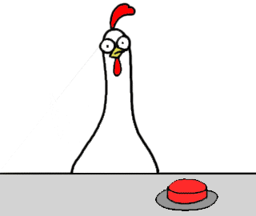

# BeCode_bon_beurre_man
Projet de groupe de création d'un jeu multijoueur

## Présentation de Bon Beurre Man

Bon Beurre Man est un jeu où le joueur incarne une poule lâchant des bombes de beurre, le but étant de faire exploser les adversaires/ennemis pour gagner.

## Présentation de l'équipe

* Project Manager : [Colard Corentin](https://github.com/c-corentin)
* Map Maker/Graphiste : [Deltenre Amaury](https://github.com/AmauD)
* Back-End : [Sekri Yassine](https://github.com/MiniYass)
* Pivot : [Mourmeaux Jean](https://github.com/Daxdrena)

## Technologies et outils utilisés

* Socket.io
* Phaser 3
* Javascript
* Node.js
* HTML 5
* Tiled

## Médias 

* Map crée à partir de différents spritesheets
* Musique du jeu crée par un ami du membre de l'équipe

